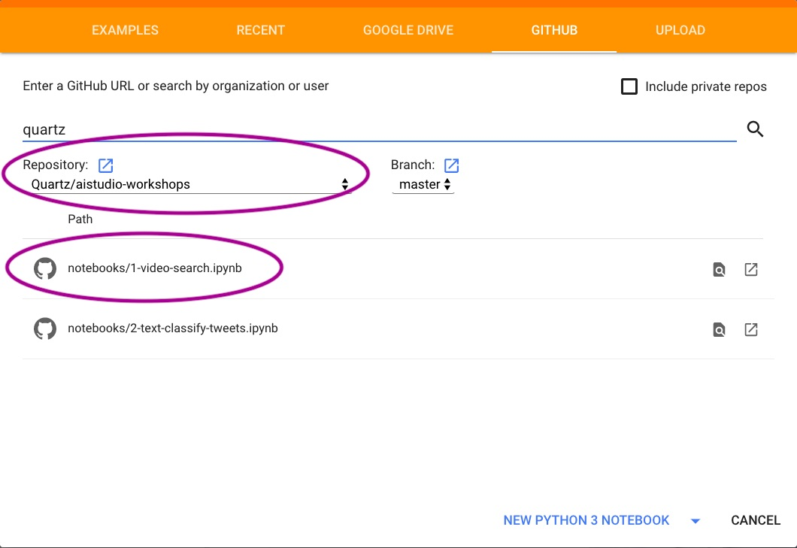
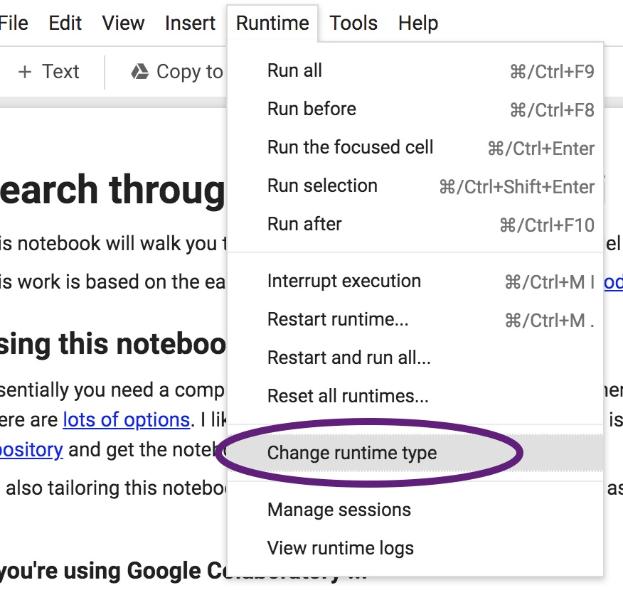
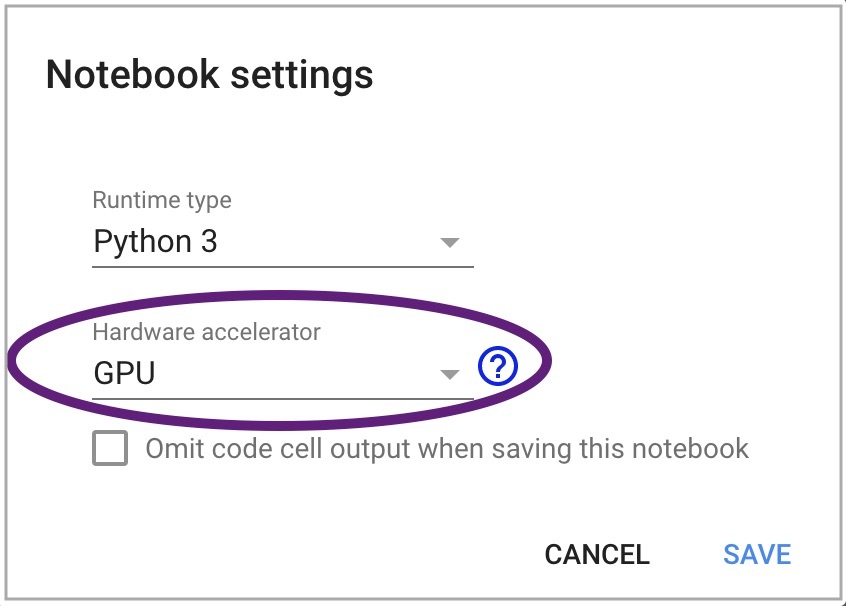
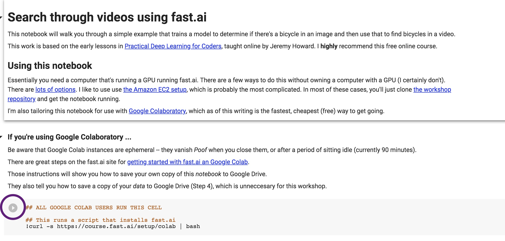
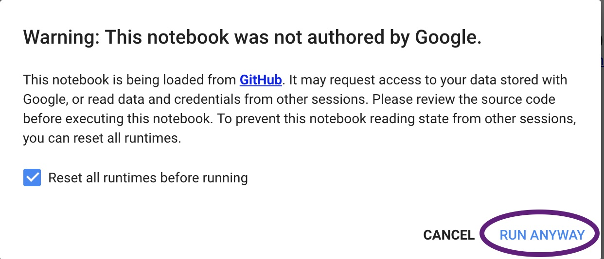
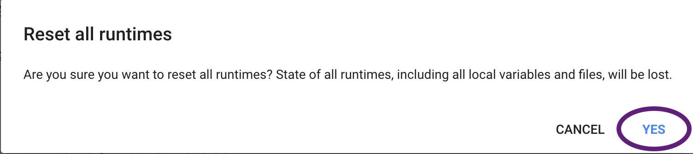

# AI Studio Workshops

## Welcome

The code here supports workshops taught by members of the Quartz, helping journalists learning machine learning.

The key materials are in the `notebooks` folder. More on that below.

## Videos

Many of the notebooks in the `notebooks` folder pair up with [a set of videos](https://qz.ai/series-machine-learning-videos/) originally recorded for an online class provided by the [UT Knight Center for Journalism in the Americas](https://knightcenter.utexas.edu/). They are now online for free!

## A note about notebooks

These workshops exist in Jupyter Notebooks (formerly IPython notebooks, which is why notebook files end in `.ipynb`). Because we'll be doing machine learning, we also need a GPU, which is a fast parallel-processor that speeds up the math we use for training models. 

At the time of this writing, the [Google Colaboratory](https://colab.research.google.com) platform provides both a notebook enviroment _and_ a GPU for free. So these notebooks are designed to work particularly well with Google Colab.

If you know how to spin up another platform – such as Amazon's EC2 – the notebooks should work there, too.

## Getting started, with Google Colab

Here's how to get started with these workshops using Google Colaboatory.

- Go to [Google Colaboratory](https://colab.research.google.com).
- In the top bar of the welcome window, pick "Github."
- Enter `quartz` on the long blue line and press Return.

 

- From the list that appears, make sure `aistudio-workshops` is the selected repository and then click on the notebook for the lesson you'd like.

 

- For many (though not all) of these lessons, we'll want to turn on the GPU. From the "Runtime" menu, pick "Change runtime type."

 

- Then form the "Hardware accellerator" dropdown, pick "GPU."

 

- You want to run the first code cell in the notebook, by tapping the "play" button on the cell that includes the code `## ALL GOOGLE COLAB USERS RUN THIS CELL`

 

- You may get one or two warnings, which you can safely dismiss:

 

 

You're all set!

## More resources

- Examples, walk-throughs and other materials are available at the [Quartz AI Studio](https://qz.ai) website.
- Many of the projects here use the great library made by [fast.ai](https://fast.ai)
- Some of the notebooks are also based on what we learned taking fast.ai's great [practical deep learning class](https://course.fast.ai/), which you should consider, too!

